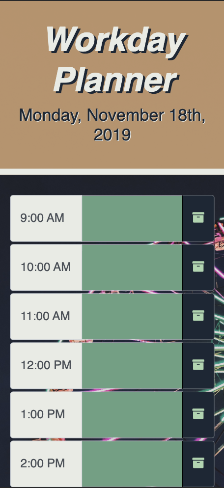

# JT Turner's Workday Planner

##Links to deployed application
Github Pages: https://github.com/javierturner/dayplanner
Deployed Application: https://javierturner.github.io/dayplanner/index.html#

##Installation

There is no installation required for this project.

##Usage

The purpose of this was to demonstrate my understanding of local storage, usage of APIs, as well as other JavaScript functions and methods, all while making a functional, usable webpage.

##Functionality
This website functions by allowing the user to enter their tasks into input fields, then pressing a "save" button, which then stores that information in the page's local storage. It remains there until the user manually clears the fields. Using moment.js API, each input field also changes colors based on the time of day (specific colors depending on if the time is in the past, present, or future). The same API also allows the current date to be displayed at the top of the page.

##Credits

° https://www.webfx.com/blog/web-design/javascript-dates-moment-js/

##Screenshots of completed application

##License

MIT License

Copyright (c) 2019 Javier Turner

Permission is hereby granted, free of charge, to any person obtaining a copy
of this software and associated documentation files (the "Software"), to deal
in the Software without restriction, including without limitation the rights
to use, copy, modify, merge, publish, distribute, sublicense, and/or sell
copies of the Software, and to permit persons to whom the Software is
furnished to do so, subject to the following conditions:

The above copyright notice and this permission notice shall be included in all
copies or substantial portions of the Software.

THE SOFTWARE IS PROVIDED "AS IS", WITHOUT WARRANTY OF ANY KIND, EXPRESS OR
IMPLIED, INCLUDING BUT NOT LIMITED TO THE WARRANTIES OF MERCHANTABILITY,
FITNESS FOR A PARTICULAR PURPOSE AND NONINFRINGEMENT. IN NO EVENT SHALL THE
AUTHORS OR COPYRIGHT HOLDERS BE LIABLE FOR ANY CLAIM, DAMAGES OR OTHER
LIABILITY, WHETHER IN AN ACTION OF CONTRACT, TORT OR OTHERWISE, ARISING FROM,
OUT OF OR IN CONNECTION WITH THE SOFTWARE OR THE USE OR OTHER DEALINGS IN THE
SOFTWARE.

